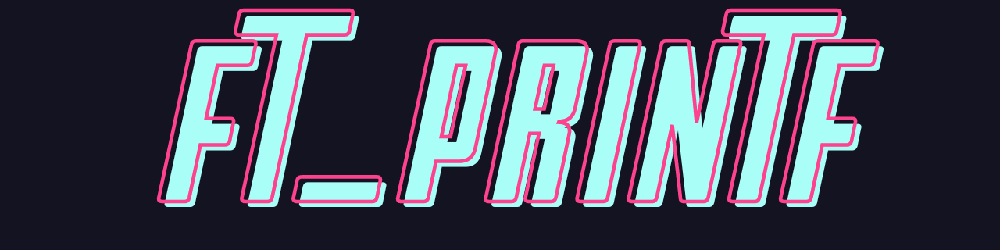
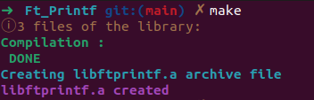
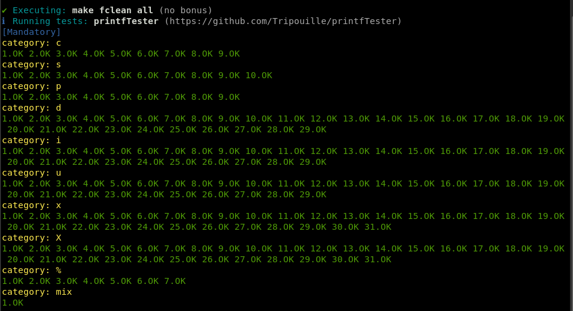
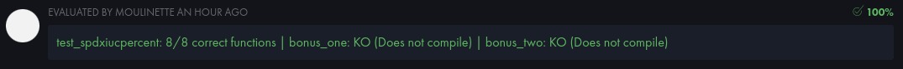
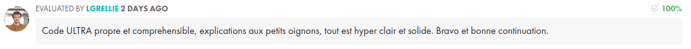
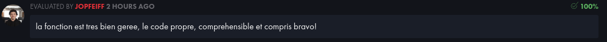
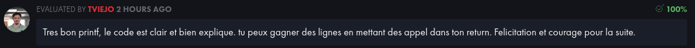

  
<p align="center">
	Ce projet t'a aidé ? Mets-lui une 🌟!
	
# Ft_Printf ✏️

Ce projet et clair et efficace. Vous devez recoder printf. Avec un peu de chance, vous serez en mesure de le réutiliser dans des projets futurs sans la crainte d'être considéré comme un trichuer. Vous apprendrez principalement à utiliser les arguments variadiques.  
Tu peux trouver le sujet [ici](fr.subject.pdf).

<br>

## Télécharge et utilise ma fonction ⬇️

Clone le projet.

```
git clone https://github.com/ugozchi/42_Ft_Printf.git
cd 42_Ft_Printf
```

<br>

## Options possibles ⚙️

Ici, vous pouvez utiliser les options classiques d'un Makefile (options ci-dessous) mais aussi l'option bonus qui vous permettra d'ajouter vos fonctions bonus dans votre fichier archive libft.a si vous les avez fait.  
Toute cette partie correspond à ce que l'on doit rendre pour ce faire corriger.

<br>

| Option | Description |
| --- | --- |
| `make` | Créer un fichier archive libftpritnf.a avec tous les fichiers |
| `make clean` | Supprime le dossier contenant les fichiers objets ```.o```|
| `make fclean` | Execute `clean` puis supprime le fichier archive ```.a``|
| `make re` | Execute `fclean` puis `make` |

<br>

## Tests  📋

Ici, c'est le moment de taper la commande make et voir si un fichier archive ```.a``` se créer bien.

<br>

| |
| --- |
|  |

<br>

Une fois cela vérifier, nous pouvons tester notre projet à l'aide de : [francinette](https://github.com/xicodomingues/francinette)

<br>

Voici les résultats :

### Première partie

<br>

| |
| --- |
|  |

<br>

| |
| --- |
|  |

<br>

### Partie Bonus

Malheureusement pas de parie bonus pour cette fois car cela me semblait trop compliqué au vue de mon niveau actuel. Mais on reviendra dessus avec plus d'expérience !!!

## Note Final et Commentaires 📔

<br>

| |
| --- |
|  |


| | |
| --- | --- |
| Moulinette |  |
| Correcteur 1 |  |
| Correcteur 2 |  |
| Correcteur 3 |  |
